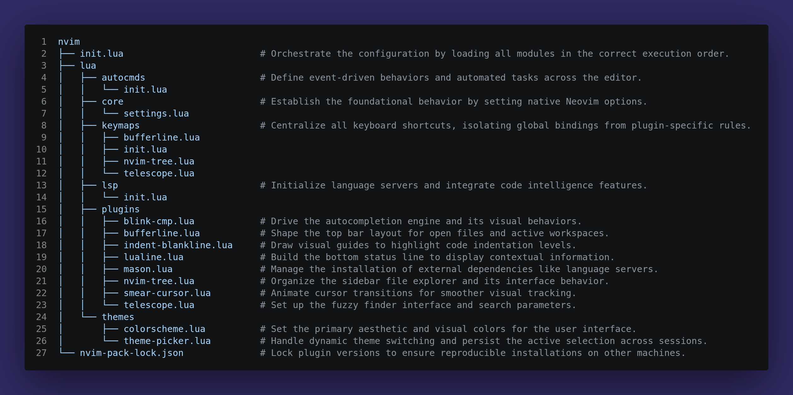

# Neovim Configuration

<p align="justify">
   
   
</p>

A modern and highly modular Neovim configuration for my daily workflow

## 🎯 About the Project

A highly modular, performance-oriented `Neovim` Configuration written entirely in `Lua`. I built this setup primarily to optimize my own daily workflow as a `DevOps` engineer and `Back-end` developer, but it is perfectly suited for anyone who shares these same needs. It provides a robust development environment right out of the box, featuring real-time code intelligence, fast file navigation, and a refined, distraction-free visual interface.

**Core Highlights:**
* **Intelligent Autocompletion:** Powered by `blink.cmp` for instantaneous, visually integrated suggestions.
* **Extensive LSP Support:** Automated setup via `mason.nvim` for `Python`, `Terraform`, `Docker`, `Ansible`, `Bash`, `Lua`, and more.
* **Frictionless Navigation:** Fast file and text searching using `telescope`, paired with a structured sidebar via `nvim-Tree`.
* **Refined UI:** Clean aesthetics managed by `lualine`, `bufferline`, and `smear-cursor` for smooth visual feedback.
* **Modular Architecture:** Responsibilities are strictly isolated into dedicated files, ensuring the codebase remains highly maintainable and easy to extend.

## 📦 Dependencies

Since this configuration was built from scratch without relying on distributions or configuration frameworks such as LazyVim, NvChad, or similar projects and some dependencies had to be installed manually along the way. To ensure all features (especially fuzzy finding, syntax highlighting, and visual icons) function correctly, the following system dependencies are required:

* `Neovim` version `0.12.0` or higher.
* A patched font (e.g., *`JetBrainsMono Nerd Font`* set as your terminal's default to properly render icons in the statusline and file explorer.
* `Node.js` and `npm`, required by `Mason` to install and run certain language servers (e.g., `pyright`, `bashls`).
* `Python` and `pip`, required by `Mason` for `Python`-based tooling (e.g., `ruff`).
* `ripgrep`, required for fast fuzzy finding.
* `LuaRocks`, required for `Lua` package management.
* `fd-find`, required as a faster alternative to `find`.
* `python3-venv`, required to create isolated `Python` environments for tooling like `ruff`.

In my case, I'm using `Linux Mint`, which is based on `Debian`/`Ubuntu`, so the package names below correspond to Debian-based distributions. Depending on your system, you may already have some of these installed; if not, install them manually, keeping in mind that package names can vary across operating systems and Linux distributions. Use the list below as a reference if you're on a different system, look for the equivalent packages in your platform's package manager:

```bash
sudo apt update
sudo apt install ripgrep fd-find python3-venv
```

## 📥 Installation

Before we start, please note that this repository **does not cover** how to install `Neovim` itself. 

Because the installation process varies significantly depending on your operating system (`Linux`, `macOS`, or `Windows`) and package manager, the best approach is to follow the [official Neovim installation guide](https://github.com/neovim/neovim/blob/master/INSTALL.md) for instructions tailored to your specific environment.

Once you have successfully installed `Neovim` and confirmed it is **working correctly**, you are ready to apply this project's files. 

To make the configuration setup as seamless as possible, I've created an automated installation script that handles the heavy lifting for you.

> [!IMPORTANT]
> It’s essential that you have already completed the previous topic: [Dependencies](#-dependencies) and carefully followed each section before continuing. This ensures that everything is properly configured so `Neovim` runs smoothly and the settings from this project are applied correctly without any issues.

**1. Run the installation script:**
```bash
curl -sL https://raw.githubusercontent.com/thomaspalma1/nvim/main/install.sh | bash
```

*The script will automatically handle backing up your existing configuration and cloning this repository.*

**2. Launch `Neovim`:**
```bash
nvim
```
*Upon the first launch, the configuration will automatically set itself up, downloading the package manager and installing all defined plugins and language servers. Restart `Neovim` once the process is complete.*

## 🏗️ Project Structure

The image below shows how this project's directories are organized. It also includes brief notes explaining the purpose of each file and folder.

One of `Neovim`'s greatest strengths is its flexibility. There is no single "correct" way to organize configuration files. While the community widely adopts certain structures, everyone is **free to adapt their setup to fit their own needs and preferences**.

In my case, I chose to organize the files as shown below. This structure gives me greater control over each part of the configuration while keeping everything organized by context and responsibility. As a result, it's much easier to locate, understand, and modify any configuration whenever needed.



As you can see in the image, there are short notes next to each directory and file, providing a concise explanation of their purpose.

If you're interested, I encourage you to explore those directories and files. Each file contains a more detailed description explaining what it does and the purpose behind each configuration.

This makes it easier to understand the project's structure and helps you see not only how the configurations were implemented, but also the reasoning behind each decision.

## 🛠️ Customization

This configuration was designed to be highly modular and easy to customize. Because each component is isolated in its own directory, you can tweak specific behaviors without breaking the entire editor. 

Common customizations include:

* **Adding new plugins:** Simply drop a new `.lua` file into the `lua/plugins/` directory and require it in the root `init.lua`.
* **Installing additional LSP servers:** Open `lua/lsp/init.lua` and append your desired language server to the `ensure_installed` array within the `Mason` configuration block.
* **Creating custom keymaps:** Modify the specific context files inside `lua/keymaps/` (e.g., `telescope.lua` or `nvim-tree.lua`) to adjust shortcuts while keeping global and plugin-specific bindings separated.
* **Changing the active colorscheme:** Browse and apply new themes interactively using the `Telescope` theme picker, or set your permanent default inside `lua/themes/colorscheme.lua`.
* **Adjusting editor options:** Tweak foundational rules like line numbers, indentation size, and clipboard integrations directly in `lua/core/settings.lua`.

## ⚠️ Known Limitations

* **Manual Dependencies:** Some plugins require external system dependencies to be installed manually (such as `ripgrep`, `fd`, `Node.js`, and `Python` virtual environments), which are not handled automatically by the `Neovim` package manager.
* **OS Compatibility:** This configuration was primarily built and tested on `Linux` (`Ubuntu`/`Debian`). While `Neovim` is cross-platform, macOS or `Windows` (`WSL`) users might need to adapt specific paths, clipboard providers, or `Mason` dependencies to ensure full functionality.
* **Initial Loading Time:** The very first time you launch the editor, the bootstrap process might take a few minutes as `Mason` downloads and compiles the required language server binaries in the background.

## 🔮 Future Improvements

* Introduce `conform.nvim` to automatically format `Terraform`, `Python`, and `Lua` files on save.
